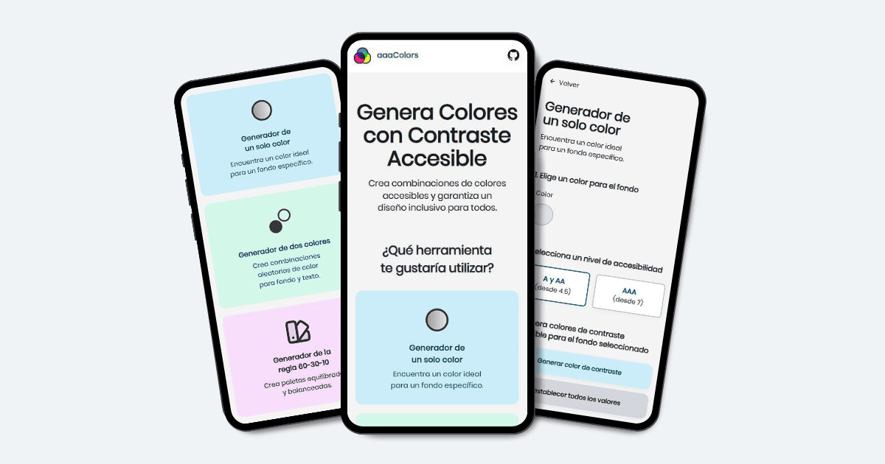
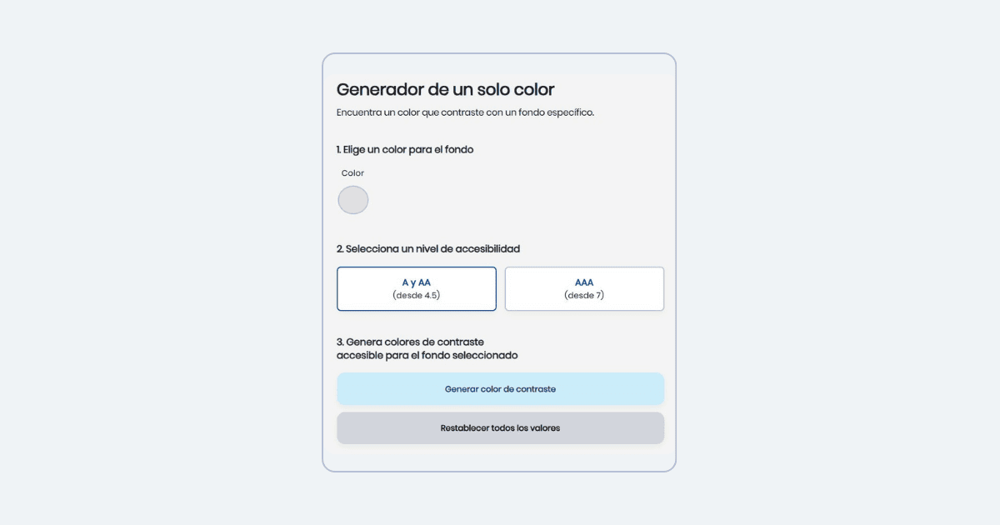
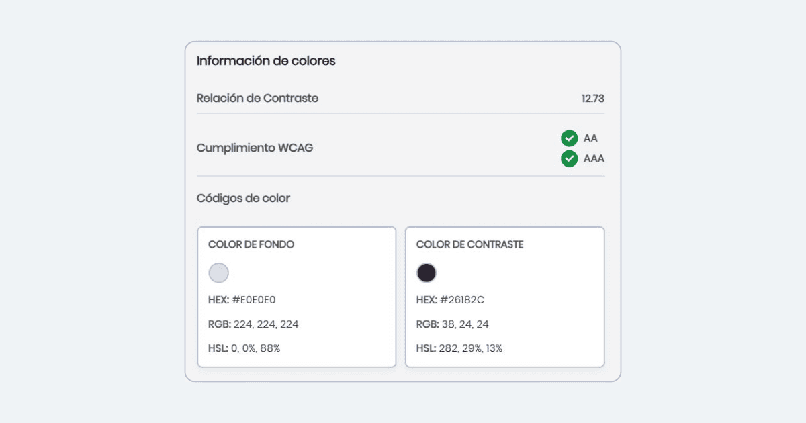

# AAA COLORS: Generador de Colores Accesibles

**AAA COLORS** es un sitio web que ayuda a generar combinaciones de colores que siguen las recomendaciones de las Pautas de Accesibilidad para el Contenido Web (WCAG) con el fin de mejorar la legibilidad y crear diseños inclusivos.

Posee 3 herramientas:

- **Generador de un solo color**: Te permite encontrar un color que contraste con un fondo específico.

- **Generador de dos colores**: Te permite crear combinaciones aleatorias de color para fondo y texto.

- **Generador de la regla 60-30-10**: Te permite crear paletas equilibradas y balanceadas siguiendo la regla 60-30-10.

Todos los generadores permiten seleccionar el nivel de accesibilidad A/AA (desde 4.5) o AAA (desde 7), lo cual siempre garantiza que la relación de contraste cumpla con las recomendaciones de las WCAG.

## Utilidad

**AAA COLORS** es útil para:

- Crear combinaciones de colores funcionales y accesibles de manera automática.

- Garantizar que el contenido sea fácil de leer.

- Obtener inspiración.

La accesibilidad en los colores es fundamental para garantizar que las personas con diferentes discapacidades visuales puedan consumir contenido sin barreras.

## Vista previa

## Tecnologías utilizadas

- **HTML:** Estructura y contenido.

- **CSS:** Estilización y diseño responsivo.

- **JavaScript:** Funcionalidad interactiva.

## Comprueba cómo funciona

Accede al sitio web y empieza a generar combinaciones accesibles → [Generador de colores accesibles](https://aaacolors.vercel.app/)

## Reportar problemas

Si encuentras algún error o tienes sugerencias, por favor abre una issue en GitHub para discutirlo:

Abre un Issue aquí → [Issues](https://github.com/LucianoTreachi/aaa-colors/issues)

## Desarrollado por

**Luciano Treachi**

Soy un Desarrollador Frontend dedicado a crear soluciones web eficientes, accesibles, intuitivas y fáciles de usar que potencian la experiencia del usuario.

